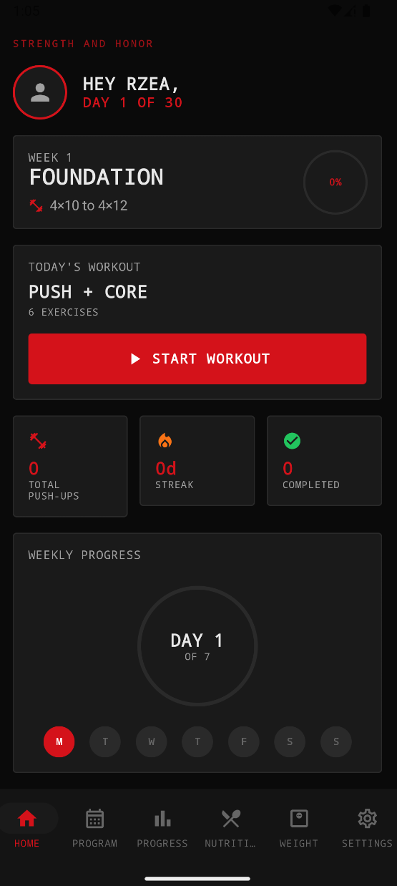
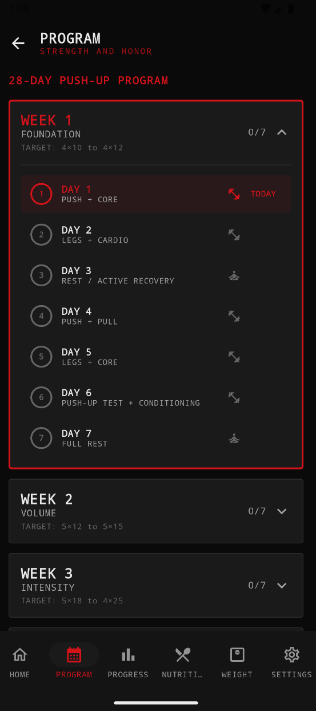
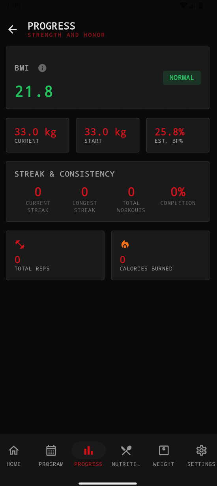
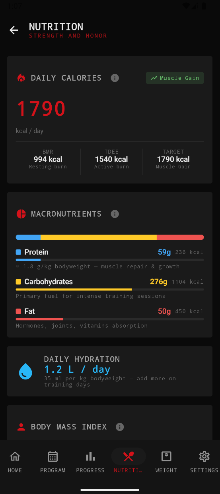
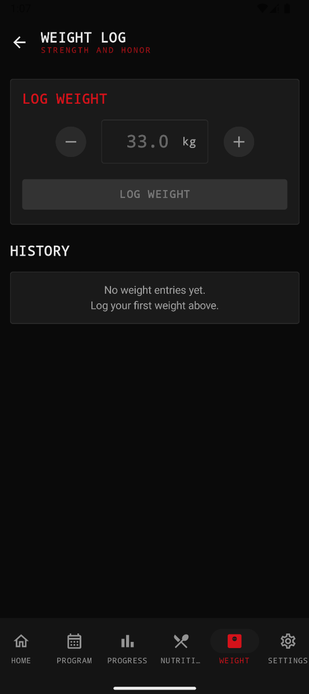
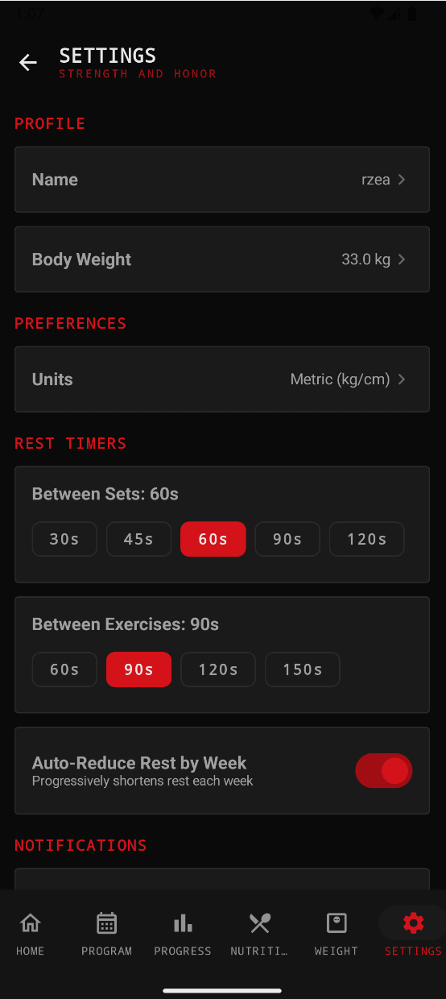

# CENTURION — 100 Push-Up Challenge

A native Android app that guides you through a 30-day bodyweight training program to build up to **100 consecutive push-ups**. Built with Kotlin and Jetpack Compose, featuring a dark brutalist aesthetic with bold red accents.

## Screenshots

### Home
Your daily dashboard — today's workout card, quick-access grid, and streak counter at a glance.

### Program
A 4-week calendar view showing your progression from foundation to the final 100 push-up challenge. Each day is marked as complete, current, or locked.

### Progress
Track your journey with charts for push-up reps over time, weight trends, total reps, streaks, and calorie burn.

### Nutrition
Personalized nutrition calculator with BMR/TDEE, daily calorie target, macro split (protein/carbs/fat), hydration goal, and BMI scale — all tailored to your goal (cut / maintain / bulk).

### Weight Log
Daily weigh-in entry with a trend chart to visualize your body weight over time.

### Settings
Configure notifications, unit preferences (kg/lbs, cm/ft), export your data as CSV, or reset your progress.

## Features

- **30-Day Program** — 4 weeks progressing from foundation to the 100 push-up challenge
- **Fitness Level Adaptation** — Beginner / Intermediate / Advanced adjustments
- **Rest Timer System** — Auto-countdown between sets with progressive reduction
- **Set-by-Set Tracking** — Individual set completion with visual circles
- **Timed Exercise Support** — Inline countdown for planks, wall sits, etc.
- **Body Weight Logging** — Track weight with trend visualization
- **Push-Up Test Tracking** — Record max push-up tests on Day 6 of each week
- **Progress Stats** — BMI, streaks, total reps, calorie estimates
- **Nutrition Calculator** — Personalized macros, calories, and hydration
- **Daily Reminders** — Configurable notifications via WorkManager
- **Custom Exercise Images** — Replace any illustration with personal photos
- **Dark Brutalist Theme** — High-contrast dark theme with red accents
- **Data Export** — Export workout history as CSV

## Architecture

See [Architecture.md](Architecture.md) for the full tech stack, project structure, build instructions, and design details.

## License

Private project — all rights reserved.